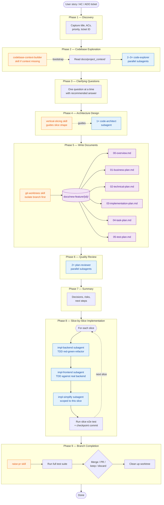

# Orchestrator workflow

The `orchestrator` skill drives a feature from a user story to a merged PR
through 9 phases. Each phase dispatches helper subagents or invokes companion
skills as needed. The diagram below maps phase → components → artifacts.

## Component legend

| Type | Examples | Where defined |
|---|---|---|
| **Subagent** (blue) | `code-explorer`, `code-architect`, `plan-reviewer`, `impl-backend`, `impl-frontend`, `impl-simplify` | `prd-pr-copilot/agents/*.agent.md` · `prd-pr-claude/agents/*.md` |
| **Skill** (orange) | `orchestrator`, `codebase-context-builder`, `vertical-slicing`, `git-worktrees`, `raise-pr`, `react-best-practices`, `restful-api-design`, `backend-implementer`, `frontend-implementer`, `context-updater` | `*/skills/<name>/SKILL.md` |
| **Artifact** (purple) | The 6 plan files written in Phase 5 | `docs/new-feature/{id}-{summary}/` |

## Phase → component matrix

| Phase | Subagents dispatched | Skills invoked | Output |
|---|---|---|---|
| 1 Discovery | — | — | Captured ACs, ticket metadata |
| 2 Codebase Exploration | 2–3× `code-explorer` (parallel) | `codebase-context-builder` (if missing) | Reference impl, patterns, key files |
| 3 Clarifying Questions | — | — | Resolved decisions |
| 4 Architecture Design | 1× `code-architect` | `vertical-slicing` (style guide) | Slice list + change-site map |
| 5 Write Documents | — | `git-worktrees` (isolate) | 6 plan files in `docs/new-feature/{id}/` |
| 6 Quality Review | 2× `plan-reviewer` (parallel) | — | Review findings, doc fixes |
| 7 Summary | — | — | Hand-off briefing |
| 8 Slice-by-slice Impl | per slice: `impl-backend` → `impl-frontend` → `impl-simplify` | `vertical-slicing`, `backend-implementer`, `frontend-implementer`, `react-best-practices`, `restful-api-design` | Code + tests + checkpoint commits |
| 9 Branch Completion | — | `raise-pr` | PR or merge + worktree cleanup |
