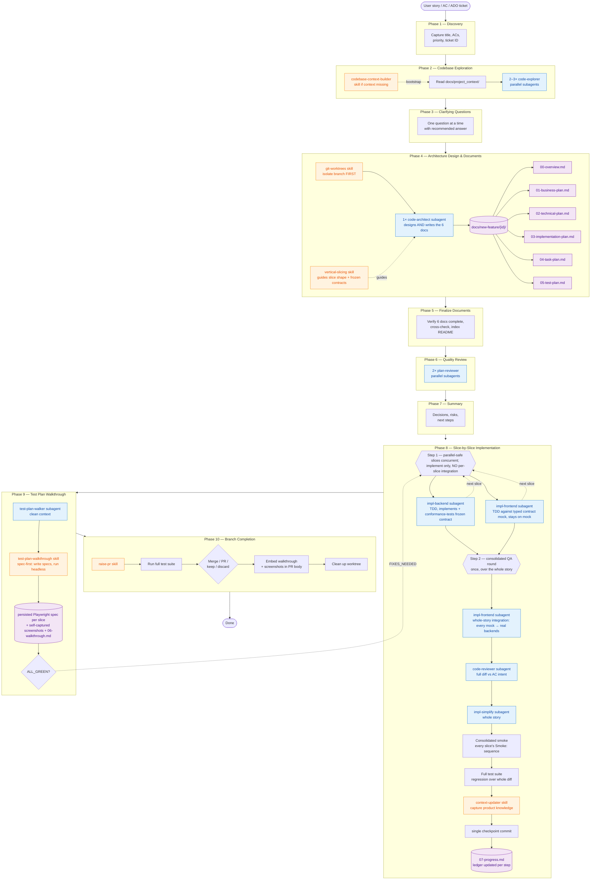

# Orchestrator workflow

The `orchestrator` skill drives a feature from a user story to a merged PR
through 10 phases. Each phase dispatches helper subagents or invokes companion
skills as needed. The diagram below maps phase → components → artifacts.

```mermaid
flowchart TD
    Start([User story / AC / ADO ticket]) --> P1

    subgraph P1[Phase 1 — Discovery]
        P1A[Capture title, ACs,<br/>priority, ticket ID]
    end

    subgraph P2[Phase 2 — Codebase Exploration]
        P2A[Read docs/project_context/]
        P2B[2–3× code-explorer<br/>parallel subagents]
        P2C[codebase-context-builder<br/>skill if context missing]
        P2A --> P2B
        P2C -.bootstrap.-> P2A
    end

    subgraph P3[Phase 3 — Clarifying Questions]
        P3A[One question at a time<br/>with recommended answer]
    end

    subgraph P4[Phase 4 — Architecture Design &amp; Documents]
        P4W[git-worktrees skill<br/>isolate branch FIRST]
        P4W --> P4A[1× code-architect subagent<br/>designs AND writes the 6 docs]
        P4B[vertical-slicing skill<br/>guides slice shape + frozen contracts]
        P4B -.guides.-> P4A
        P4A --> P5D[("docs/new-feature/{id}/")]
        P5D --> F0[00-overview.md]
        P5D --> F1[01-business-plan.md]
        P5D --> F2[02-technical-plan.md]
        P5D --> F3[03-implementation-plan.md]
        P5D --> F4[04-task-plan.md]
        P5D --> F5[05-test-plan.md]
    end

    subgraph P5[Phase 5 — Finalize Documents]
        P5V[Verify 6 docs complete,<br/>cross-check, index README]
    end

    subgraph P6[Phase 6 — Quality Review]
        P6A[2× plan-reviewer<br/>parallel subagents]
    end

    subgraph P7[Phase 7 — Summary]
        P7A[Decisions, risks,<br/>next steps]
    end

    subgraph P8[Phase 8 — Slice-by-Slice Implementation]
        direction TB
        P8L{{Step 1 — parallel-safe slices concurrent; implement only, NO per-slice integration}}
        P8L --> P8B[impl-backend subagent<br/>TDD, implements + conformance-tests frozen contract]
        P8L --> P8F[impl-frontend subagent<br/>TDD against typed contract mock, stays on mock]
        P8B -.next slice.-> P8L
        P8F -.next slice.-> P8L
        P8B --> P8Q{{Step 2 — consolidated QA round<br/>once, over the whole story}}
        P8F --> P8Q
        P8Q --> P8I[impl-frontend subagent<br/>whole-story integration: every mock → real backends]
        P8I --> P8R[code-reviewer subagent<br/>full diff vs AC intent]
        P8R --> P8S[impl-simplify subagent<br/>whole story]
        P8S --> P8M[Consolidated smoke<br/>every slice's Smoke: sequence]
        P8M --> P8E[Full test suite<br/>regression over whole diff]
        P8E --> P8C[context-updater skill<br/>capture product knowledge]
        P8C --> P8K[single checkpoint commit]
        P8K --> P8P[("07-progress.md<br/>ledger updated per step")]
    end

    subgraph P9[Phase 9 — Test Plan Walkthrough]
        P9A[test-plan-walker subagent<br/>clean context]
        P9A --> P9T[test-plan-walkthrough skill<br/>spec-first: write specs, run headless]
        P9T --> P9R[("persisted Playwright spec per slice<br/>+ self-captured screenshots + 06-walkthrough.md")]
        P9R --> P9G{ALL_GREEN?}
        P9G -.FIXES_NEEDED.-> P8L
    end

    subgraph P10[Phase 10 — Branch Completion]
        P10A[raise-pr skill]
        P10A --> P10B[Run full test suite]
        P10B --> P10C{Merge / PR /<br/>keep / discard}
        P10C --> P10D[Embed walkthrough<br/>+ screenshots in PR body]
        P10D --> P10E[Clean up worktree]
    end

    P1 --> P2 --> P3 --> P4 --> P5 --> P6 --> P7 --> P8 --> P9 --> P10 --> Done([Done])

    classDef subagent fill:#e3f2fd,stroke:#1976d2,color:#0d47a1
    classDef skill fill:#fff3e0,stroke:#f57c00,color:#e65100
    classDef artifact fill:#f3e5f5,stroke:#7b1fa2,color:#4a148c
    classDef phase fill:#f5f5f5,stroke:#616161,color:#212121

    class P2B,P4A,P6A,P8B,P8F,P8I,P8S,P8R,P9A subagent
    class P2C,P4B,P4W,P8C,P9T,P10A skill
    class P5D,F0,F1,F2,F3,F4,F5,P8P,P9R artifact
```

## Component legend

| Type | Examples | Where defined |
|---|---|---|
| **Subagent** (blue) | `code-explorer`, `code-architect`, `plan-reviewer`, `impl-backend`, `impl-frontend`, `impl-simplify`, `code-reviewer`, `test-plan-walker` | `prd-pr/agents/*.md` |
| **Skill** (orange) | `orchestrator`, `codebase-context-builder`, `vertical-slicing`, `git-worktrees`, `raise-pr`, `react-best-practices`, `restful-api-design`, `backend-implementer`, `frontend-implementer`, `context-updater`, `test-plan-walkthrough` | `*/skills/<name>/SKILL.md` |
| **Artifact** (purple) | The 6 plan files written by `code-architect` in Phase 4, plus `06-walkthrough.md` + `screenshots/` from Phase 9 and the `07-progress.md` ledger from Phase 8 | `docs/new-feature/{id}-{summary}/` |

## Phase → component matrix

| Phase | Subagents dispatched | Skills invoked | Output |
|---|---|---|---|
| 1 Discovery | — | — | Captured ACs, ticket metadata |
| 2 Codebase Exploration | 2–3× `code-explorer` (parallel) | `codebase-context-builder` (if missing) | Reference impl, patterns, key files |
| 3 Clarifying Questions | — | — | Resolved decisions |
| 4 Architecture Design & Documents | 1× `code-architect` (designs **and writes** the 6 docs directly — no orchestrator transcription, closing the old ~20-min gap) | `git-worktrees` (isolate, **first**), `vertical-slicing` (slice shape + frozen per-slice contracts + the machine-readable dependency DAG) | 6 plan files in `docs/new-feature/{id}/`; slice list + frozen contracts + a `## Dependency graph` block in `04-task-plan.md` (authoritative edge table + waves + critical path) |
| 5 Finalize Documents | — | — | Verified/consistent docs + README index |
| 6 Quality Review | 2× `plan-reviewer` (parallel) | — | Review findings, doc fixes |
| 7 Summary | — | — | Hand-off briefing |
| 8 Slice-by-slice Impl | Step 1 (implement only, **no per-slice integration**): the ready-frontier and critical path are computed from `04-task-plan.md`'s `## Dependency graph` block (critical-path-first when worktree slots are scarce); parallel-safe slices run concurrently in worktrees; within each, `impl-backend` ∥ `impl-frontend` against the frozen contract — BE implements *and conformance-tests* it, FE stays on a mock. Step 2 (once, whole story): one `impl-frontend` **whole-story integration** → `code-reviewer` → `impl-simplify` → smoke → regression → `context-updater` (review loops back on `FIXES_NEEDED`) | `vertical-slicing`, `backend-implementer`, `frontend-implementer`, `react-best-practices`, `restful-api-design`, `context-updater` | Code + tests + single checkpoint commit + `07-progress.md` ledger |
| 9 Test Plan Walkthrough | 1× `test-plan-walker` (clean context, **spec-first**: writes Playwright specs that self-capture screenshots, runs them headless; re-runs are changed-surface only) | `test-plan-walkthrough` | **persisted Playwright spec per slice** (appended to project e2e suite) + self-captured screenshots + `06-walkthrough.md`; loops back to Phase 8 on `FIXES_NEEDED` |
| 10 Branch Completion | — | `raise-pr` | PR (walkthrough + screenshots embedded) or merge + worktree cleanup |
