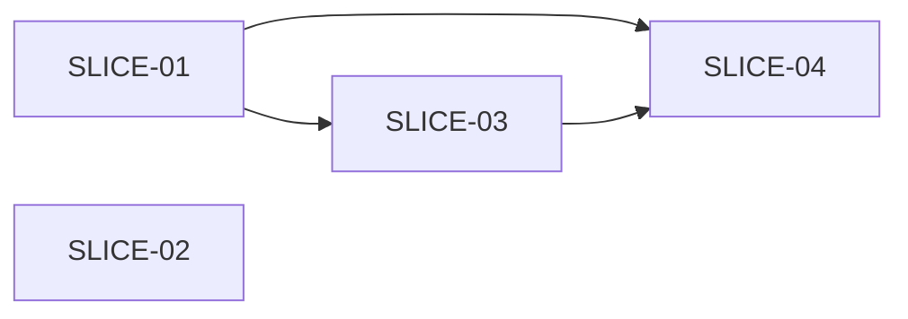

# Vertical Slicing

## Why

Horizontal sequencing — *all schema, then all services, then all APIs, then all UI* — leaves the agent blind until final integration and serialises everything. So does the old "every slice must be demoable on its own": that gate invents demo-driven dependencies and forces a per-slice integration pass.

A **slice** (still `SLICE-NN`) is a thin, vertical **work-unit** bounded by a **frozen API contract** wherever it crosses BE↔FE. The contract — not a per-slice demo — is the feedback loop: BE implements it, FE mocks it, both check against it. Slices with no *real* dependency run concurrently; the whole story is integrated and demoed **once, at the end** (Phase 9).

## What counts as a slice

A slice is the smallest chunk of the feature that (a) traverses only the layers it touches, (b) is bounded by a frozen `Contract:` wherever it crosses BE↔FE, and (c) is one PR you'd happily merge. It is still **vertical** (never a horizontal layer), but it need not be demoable in isolation.

| Not a slice | A slice |
|-------------|---------|
| "Set up the schema" (horizontal layer) | "Award points for lesson completion (`POST /lessons/{id}/complete`)" |
| "Build the service layer" (horizontal layer) | "Reject patient registration when NRIC is malformed (`422` + field error)" |
| "All the endpoints, then all the screens" | "Show patient's last visit date on the response card" |

The first slice is often a thin **scaffold** (routing, a shell, service-worker registration) that later slices genuinely depend on — build it first only when others *really* need it, not for demo value.

## Decomposition order

Decompose by **real dependency**, not by demo value:

1. **Enumerate the work-units the ACs need** — one slice per meaningfully different code path (happy paths, alternate paths, and *visible* error paths are each their own slice unless they share a code path, in which case the extra ones are test cases inside one slice). *Internal* error handling (logging, retry) is a task inside the slice that surfaces it.
2. **Draw the dependency DAG on *real* couplings only.** A slice is `Blocked by:` another only if it imports/extends the other's code, or needs its schema/migration/scaffold. A shared demo screen, a "happy path first" instinct, or "it reads better in a demo that way" are **not** dependencies — delete those edges.
3. **Everything not on a `Blocked by:` edge is parallel-safe** and fans out concurrently.

Stop when the acceptance criteria are covered.

Within a slice, tasks follow layer dependency (data → service → API → hook → component), discovered by TDD. **Across slices, never order by layer, and never order by demo** — order only by the real dependency DAG.

## Contract-first parallel halves

Within a `BE + FE` slice the two halves do **not** run one-after-the-other. They run **concurrently against a frozen API contract** captured at design time (the slice card's `Contract:` block — method, path, request/response shape, error codes). The contract is the coordination artefact:

- The **backend half** implements the contract via TDD and **asserts its responses against the frozen contract schema** (the *conformance test*) — so drift is caught per-slice at build time, without waiting for integration.
- The **frontend half** builds against a **typed mock** of the same contract (MSW handler, fixture, or the project's mock layer) and stays on it — no per-slice integration.
- **Integration is one whole-story pass at the end** (the orchestrator's consolidated round): every FE is pointed at the real backends together, once. Because each backend conformance-tested its contract, that pass is mostly mechanical wiring.

Fall back to serial BE→FE only when the contract genuinely can't be frozen up front (response shape unknown until the backend exists — rare for CRUD); say why in the card.

Two latency wins: within a slice, a 27-min BE + 22-min FE collapse from ~49 min serial to ~27 min; across the story, N per-slice integrations collapse to one. The price is contract discipline — an honest frozen contract, a conformance test, and one integration pass.

## Sizing

A slice is the size of one PR you'd happily merge.

- More than ~6 tasks → probably two slices.
- Single task that only makes sense folded into another unit's code path → fold it in.
- Rule of thumb: split on the seams that let two slices run **in parallel** (disjoint files, a clean contract between them); don't split where the halves would only serialise against each other.

## Independence and parallelism

Two axes, both default-on: **within a slice**, BE ∥ FE against the frozen contract (above); **across slices**, every slice with `Blocked by: —` fans out concurrently in its own worktree. Mark independence in the card and reserve `Blocked by:` for real couplings — not caution, not demo order.

## Anti-patterns — reject and reslice

- **Schema-first slice** ("SLICE-01: design the schema") — a horizontal layer, not a vertical work-unit.
- **All-backend / all-frontend slice** — horizontal layering relabelled.
- **A slice per layer** (SLICE-01: the API, SLICE-02: its UI) — the BE and FE halves of one behaviour are **one** slice, parallelised by the frozen contract, not two.
- **A `Blocked by:` edge that's really a demo dependency** ("the dashboard slice must come after the list slice so the demo flows") — delete the edge; if neither imports the other's code, they're parallel-safe.
- **Per-slice integration** — pointing a slice's FE at the real backend before the story is done; it re-serialises what the contract decoupled. (One *whole-story* integration is intended, not this.)

## Output shape

A slice is described by a card, not a task table. Files, repositories, and helpers are *discovered during TDD*, not pre-listed at planning time — pre-listing is the same "outrun your headlights" mistake that horizontal slicing makes.

```
## Slices

### SLICE-01 — [behaviour / outcome, one sentence]
- AC covered: AC-1 (and parts of AC-6, AC-7 if folded)
- Verify: [what the Phase 9 end-to-end spec asserts for this behaviour — not a per-slice demo, the checkpoint the story-level spec will cover]
- Type: AFK | HITL                    # AFK = agent runs autonomously; HITL = needs a human decision mid-slice
- Layers: BE + FE | BE only | FE only # which layer-halves to dispatch implementers for
- Contract: [for BE+FE slices, the frozen API contract the halves share — method + path + request/response shape + error codes; the FE half mocks this, the BE half implements AND conformance-tests it. Omit for single-layer slices.]
- Blocked by: SLICE-NN | —            # — means parallel-safe; only name a REAL coupling (shared files, needed schema/scaffold), never demo order

### SLICE-02 — [next work-unit]
...
```

## The dependency graph (machine-readable DAG)

The cards' `Blocked by:` lines *are* a DAG, but as prose nothing computes over them. Consolidate the edges into **one authoritative block atop `04-task-plan.md`** so the ready-frontier, waves, and critical path are computed once and survive a resume.

Write it above `## Slices` (four-backtick fence here only so the inner mermaid stays literal — you write it with triple backticks):

````markdown
## Dependency graph

<!-- Authoritative slice DAG. The edge table below is the single source of truth;
     the mermaid render and the derived Waves / Critical path are views of it.
     Every slice card's `Blocked by:` must match this table exactly. -->

| Slice | Layers | Size | Blocked by |
|----------|---------|-----:|--------------------|
| SLICE-01 | BE + FE | 3 | — |
| SLICE-02 | BE only | 2 | — |
| SLICE-03 | BE + FE | 5 | SLICE-01 |
| SLICE-04 | FE only | 2 | SLICE-01, SLICE-03 |



**Waves** (topological batches — wave *k* starts once every slice in waves `< k` is ✅):
- Wave 0 (parallel-safe roots): SLICE-01, SLICE-02
- Wave 1: SLICE-03
- Wave 2: SLICE-04

**Critical path** (longest chain weighted by story points): SLICE-01 → SLICE-03 → SLICE-04 = 10 pts. When worktree slots are scarce, start critical-path slices first — never leave one idle behind a lower-value slice.
````

Derivation (all mechanical):

- **Ready** — a slice is ready when every slice in its `Blocked by:` is `✅`; roots (`—`) start ready.
- **Waves** — wave 0 = roots; wave *k* = slices whose blockers all sit in waves `< k`. Coarse batch view only; the live schedule is frontier-driven (start a slice the moment its blocker finishes, not its whole wave).
- **Critical path** — max-weight root→sink path, each node weighted by `Size`. Sets the story's minimum wall-clock, so prioritise it when not every ready slice can run at once.

Keep table and cards in lockstep: edit a card's `Blocked by:`, edit its row here and re-derive. Phase 5 checks they agree; a mismatch is a planning bug.

Each slice produces **at most two implementer dispatches**: a backend half and/or a frontend half, dispatched **concurrently** against the slice's frozen `Contract:`. The implementer agent receives the slice card and runs TDD red-green-refactor against the slice's AC — it discovers which files to touch as the tests demand them. The FE half mocks the contract and does **not** integrate per-slice; integration is a single whole-story pass at the end.

If you find yourself wanting to list "migration here, repository there, handler there" inside a slice card, stop. Either the slice is too thick (split it) or you are pre-imagining the implementation (let TDD discover it).

## When NOT to slice

Single-layer bugfixes and behaviour-preserving refactors. Use slicing for new features and behaviour-adding enhancements.
