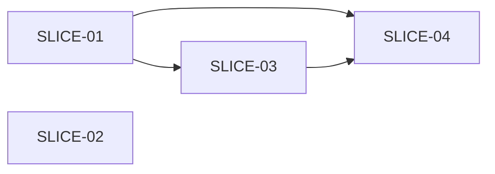

# Vertical Slicing

A **slice** (`SLICE-NN`) is a thin vertical work-unit: it traverses only the layers it needs, is bounded by a **frozen API contract** wherever it crosses BE<->FE, and is one PR you would happily merge. The contract, not a per-slice demo, is the feedback loop: the backend implements and conformance-tests it, the frontend mocks it, and the story is integrated and demoed **once, at the end**. Slices need not be demoable in isolation; requiring that invents demo-driven dependencies and forces per-slice integration.

| Not a slice | A slice |
|---|---|
| "Set up the schema" (horizontal layer) | "Award points for lesson completion (`POST /lessons/{id}/complete`)" |
| "Build the service layer" | "Reject patient registration when NRIC is malformed (`422` + field error)" |
| "All the endpoints, then all the screens" | "Show patient's last visit date on the response card" |

A thin scaffold slice (routing, shell, service-worker registration) comes first only when later slices genuinely depend on it.

## Decomposition

1. **One slice per meaningfully different code path** the ACs need. Alternate and visible error paths are their own slices unless they share a code path, in which case they are test cases inside one slice. Internal error handling (logging, retry) is a task inside the slice that surfaces it.
2. **Draw the dependency DAG on real couplings only.** A slice is `Blocked by:` another only if it imports or extends its code or needs its schema/migration/scaffold. A shared demo screen or a "happy path first" instinct is not a dependency; delete the edge.
3. Everything not on an edge is parallel-safe. Stop when the ACs are covered.

Within a slice, layer order (data → service → API → hook → component) is discovered by TDD. Across slices, never order by layer or by demo.

## Contract-first parallel halves

Within a `BE + FE` slice the halves run **concurrently** against the card's `Contract:` (method, path, request/response shape, error codes), captured at design time:

- The backend implements it via TDD and adds a **conformance test** asserting its responses match the contract schema, so drift surfaces at build time.
- The frontend builds against a **typed mock** of it (MSW handler, fixture, or the project's mock layer) and stays on the mock.
- **Integration is one whole-story pass at the end**: every FE pointed at the real backends together, mostly mechanical because each backend already conformance-tested.

Fall back to serial BE→FE only when the response shape genuinely cannot be frozen up front (rare for CRUD); say why in the card.

## Sizing

One PR's worth. More than ~6 ACs or two heavy halves → split. A single task that only makes sense inside another slice's code path → fold it in. Split on seams that let two slices run in parallel (disjoint files, a clean contract); do not split where the halves would only serialise against each other.

## Anti-patterns - reject and reslice

- Schema-first, all-backend or all-frontend slices (horizontal layering relabelled).
- One slice for the API and another for its UI: the halves of one behaviour are **one** slice, parallelised by the contract.
- A `Blocked by:` edge that is really demo order.
- Per-slice integration: pointing a slice's FE at the real backend before the story is done re-serialises what the contract decoupled.
- A per-file task table inside a card ("migration here, repository there"). Either the slice is too thick or you are pre-imagining the implementation; let TDD discover files.

## Slice card

```
### SLICE-01 - [behaviour / outcome, one sentence]
- AC covered: AC-1 (and parts of AC-6 if folded)
- Verify: [what the Phase 9 end-to-end spec asserts for this behaviour]
- Type: AFK | HITL                    # HITL = needs a human decision mid-slice
- Layers: BE + FE | BE only | FE only
- Contract: [BE+FE only: method + path + request/response shape + error codes]
- Blocked by: SLICE-NN | -            # real couplings only
```

## Dependency graph

The cards' `Blocked by:` lines are a DAG; consolidate them into one authoritative block **above `## Slices` in `04-task-plan.md`** so the ready frontier, waves and critical path are computed once and survive a resume. (Four-backtick fence here only so the inner mermaid stays literal.)

````markdown
## Dependency graph

<!-- Authoritative slice DAG. The edge table is the single source of truth;
     the mermaid render and the derived Waves / Critical path are views of it.
     Every slice card's `Blocked by:` must match this table exactly. -->

| Slice | Layers | Size | Blocked by |
|----------|---------|-----:|--------------------|
| SLICE-01 | BE + FE | 3 | - |
| SLICE-02 | BE only | 2 | - |
| SLICE-03 | BE + FE | 5 | SLICE-01 |
| SLICE-04 | FE only | 2 | SLICE-01, SLICE-03 |



**Waves** (wave *k* starts once every slice in waves `< k` is ✅):
- Wave 0: SLICE-01, SLICE-02
- Wave 1: SLICE-03
- Wave 2: SLICE-04

**Critical path** (longest chain weighted by story points): SLICE-01 → SLICE-03 → SLICE-04 = 10 pts. When worktree slots are scarce, start critical-path slices first.
````

Derivation: a slice is ready when every blocker is ✅ (roots start ready); wave *k* = slices whose blockers all sit in earlier waves (a coarse view; the live schedule is frontier-driven); critical path = max-weight root→sink path by `Size`. Edit a card's `Blocked by:` → edit its row and re-derive. Phase 5 checks they agree.

## When not to slice

Single-layer bugfixes and behaviour-preserving refactors get a flat task list.
